# FreshSalt Surface APP 框架决策树

版本：2026-06-13  
形式：Markdown 决策树 + 节点规格  
适用对象：大学物理实验竞赛 APP 平台搭建、模拟数据验证、后续真实模型接入  

---

## 0. 总定位

FreshSalt Surface / 表面盐影像助手是一款 Android 优先的实验测量型 APP。它不直接给食品安全结论，而是围绕受控 RGB 成像完成：

- 基线图 I0 采集；
- 待测图 I1 采集；
- 灰卡/ROI/曝光/清晰度质控；
- 图像特征提取；
- 模型包本地推理；
- 结果图表解释；
- 历史记录；
- 报告导出；
- 点击式模拟验证。

所有模拟数据必须显示“模拟”标记。正式结果必须绑定 `model_id`、`hardware_profile_id`、`source_mode`、`valid_range`。

---

## 1. 总体决策树

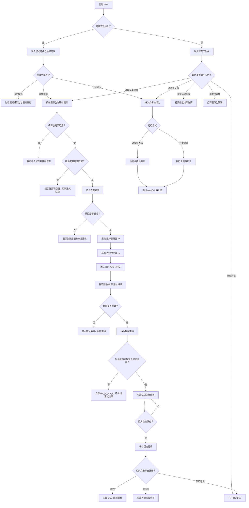

---

## 2. 节点规格总表

| 节点 ID | 页面/模块 | 输入 | 点击交互 | 反馈响应 / 运行模型 | 输出 |
|---|---|---|---|---|---|
| A | 启动页 | 本地设置、最近 session、模型包索引 | 自动进入 | 读取本地状态；判断是否首次进入 | `app_boot_state` |
| C | 模式选择 | 用户选择、权限状态 | 点击“演示模式”“采集预测”“点击验证” | 显示边界提示；记录 `source_mode` | `selected_mode` |
| D | 首页工作台 | 当前模式、最近结果、模型状态 | 点击主入口/快捷入口 | 根据入口导航；显示模拟徽标 | 页面路由目标 |
| M0 | 模型包管理 | `model_bundle.json`、本地模型索引 | 点击导入/启用/查看模型卡 | 校验字段、有效范围、特征顺序 | `active_model_bundle` |
| D2 | 硬件配置 | `hardware_profile_id`、ROI 面积、相机/光源配置 | 点击保存配置 | 比对模型包要求 | `hardware_match_status` |
| Q0 | 成像质控 | 灰卡图、预览图、曝光参数、ROI 预检 | 点击“开始质控” | 计算曝光、清晰度、灰卡 RSD、ROI 完整性 | `qc_status`、`qc_flags` |
| I0 | 基线图采集 | 相机预览/模拟基线图 | 点击拍摄/选择模拟图 | 保存缩略图、路径、元数据 | `baseline_image_path` |
| I1 | 待测图采集 | 相机预览/模拟待测图 | 点击拍摄/选择模拟图 | 保存缩略图、路径、元数据 | `salted_image_path` |
| ROI | ROI 确认 | I0、I1、灰卡区域、ROI 多边形 | 拖动/确认 ROI | 校验面积、边界、灰卡区域 | `roi_polygon`、`gray_card_roi` |
| F0 | 特征提取 | I0、I1、ROI、灰卡、预处理版本 | 点击“提取特征” | 运行图像预处理与特征提取 | `feature_vector` |
| P2 | 模型推理 | `feature_vector`、`model_bundle` | 点击“计算结果” | 标准化特征；运行 Ridge/线性模型；做范围判定 | `prediction_result` |
| R3 | 结果详情 | 预测结果、历史、特征、模型卡 | 点击保存/查看解释/导出 | 展示范围标尺、趋势图、贡献图、边界提示 | 结果详情 UI |
| S1 | 保存历史 | `prediction_result`、session、图像路径 | 点击“保存历史” | 写入 repository；模拟数据标记 | 历史记录 |
| H0 | 历史记录 | 本地记录、筛选条件 | 点击筛选/详情/删除 | 筛选模拟/正式；删除需确认 | 历史列表/详情 |
| EXP1 | CSV 导出 | 历史记录/单条结果 | 点击“复制 CSV”或“导出 CSV” | 生成字段完整 CSV | CSV 文本/文件 |
| EXP2 | 报告页 | 结果、图像、ROI、模型卡、风险说明 | 点击“生成报告” | 生成可截图报告页 | 报告预览 |
| V0 | 点击验证台 | `mock_click_cases`、mock 图片、mock 模型 | 点击单项/一键全链路 | 执行断言；记录输入、输出、耗时 | `click_log`、`pass/fail` |

---

## 3. 首页决策树

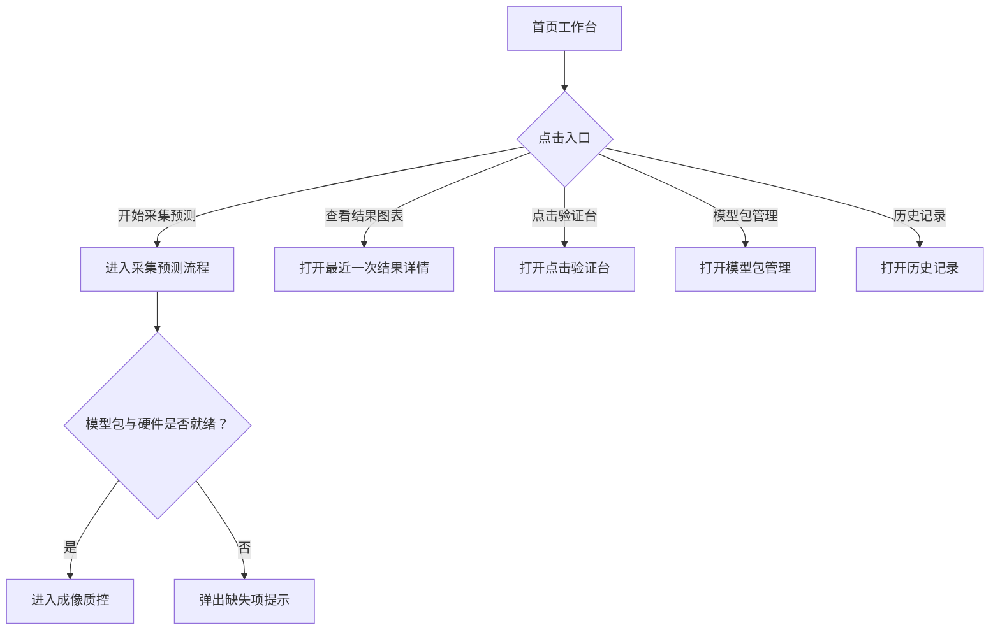

| 首页元素 | 输入 | 点击交互 | 反馈响应 | 输出 |
|---|---|---|---|---|
| 顶部状态芯片 | `source_mode`、`hardware_profile_id` | 无 | 显示“模拟模式”“暗箱 darkbox_v1” | 当前工作状态 |
| 今日任务卡 | 配置状态、质控状态、推理状态 | 点击任一状态 | 跳转到对应步骤 | 任务步骤页 |
| 开始采集预测按钮 | active model、硬件配置 | 点击 | 若缺模型则弹窗；若就绪则进入质控 | 路由到采集页 |
| 查看结果图表 | 最近结果 | 点击 | 若无记录则显示空状态；有记录则打开结果详情 | 最近结果详情 |
| 点击验证台 | mock cases | 点击 | 打开验证台 | 验证台页面 |

---

## 4. 模型包与硬件配置决策树

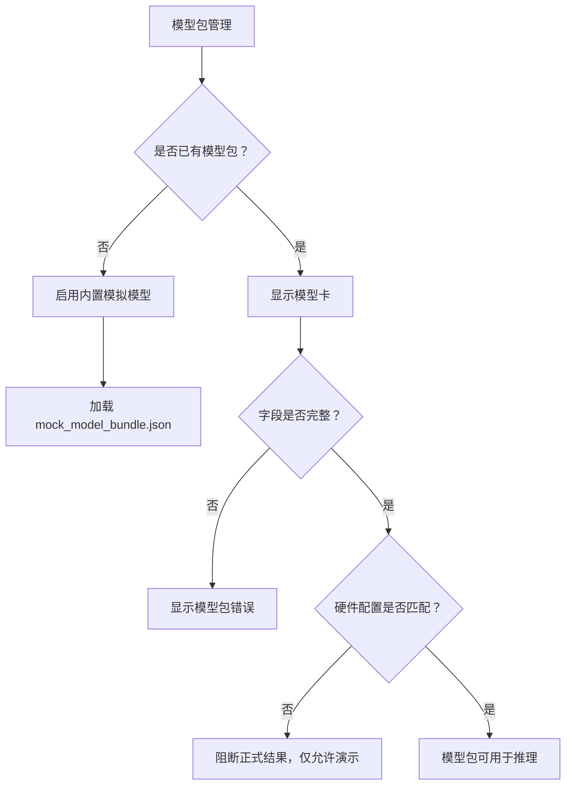

| 字段/输入 | 来源 | 校验规则 | 失败反馈 | 成功输出 |
|---|---|---|---|---|
| `model_id` | model_bundle | 不为空 | “模型包缺少 model_id” | 当前模型 ID |
| `sample_type` | model_bundle | 与当前样品类型一致 | “样品类型不匹配” | 样品类型可用 |
| `hardware_profile` | model_bundle + 设置 | 相机/暗箱/光源/ROI 面积一致 | “硬件配置不匹配，禁止正式结果” | 硬件匹配 |
| `valid_range_mg_cm2` | model_bundle | 上下限有效 | “模型有效范围缺失” | 范围标尺 |
| `feature_order` | model_bundle | 与特征向量一致 | “特征顺序不一致” | 推理输入顺序 |
| `coefficients` | model_bundle | 长度等于特征数 | “模型系数长度错误” | 推理模型 |
| `source` | model_bundle | 模拟模型必须为 `simulated` | “模拟模型未标记” | 模拟标识 |

---

## 5. 采集预测决策树

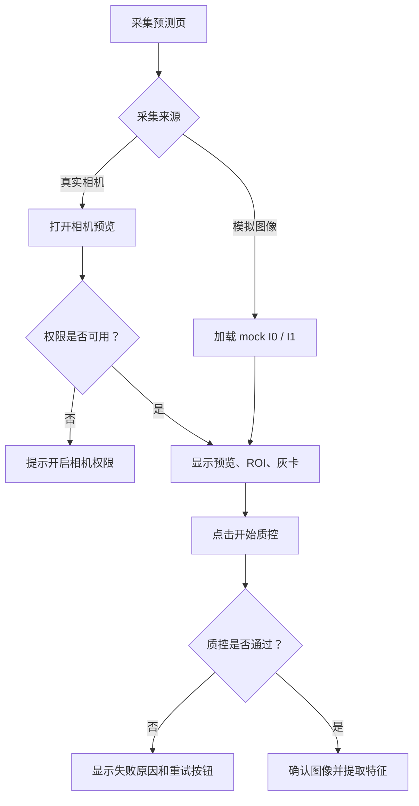

| 步骤 | 输入 | 点击交互 | 反馈响应 / 运行模型 | 输出 |
|---|---|---|---|---|
| 选择图像来源 | 真实相机/模拟图像 | 点击“替换模拟图像”或“拍摄” | 更新预览区；模拟模式显示徽标 | `image_source` |
| 灰卡区域 | 图像左上角灰卡 ROI | 点击/拖动灰卡框 | 若区域过暗/过曝则警告 | `gray_card_roi` |
| ROI 区域 | 样品区域多边形 | 拖动 ROI 框、点击确认 | 校验面积是否为 4 cm2；是否越界 | `roi_polygon` |
| 曝光质控 | I0/I1 图像 | 点击“开始质控” | 计算过曝比例；阈值示例 `< 0.5%` | `exposure_pass` |
| 清晰度质控 | I0/I1 图像 | 自动运行 | 计算 Laplacian variance；低于阈值则失败 | `sharpness_pass` |
| 灰卡稳定性 | 灰卡 RGB | 自动运行 | 计算 RSD；示例 `RSD <= 2%` 通过 | `gray_rsd` |
| ROI 完整性 | ROI polygon | 自动运行 | 越界、面积为 0、缺样品则失败 | `roi_pass` |

---

## 6. 图像处理与特征提取决策树

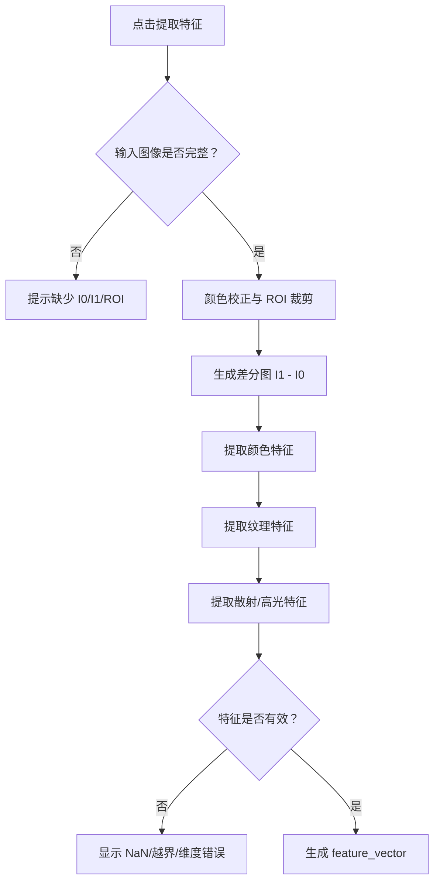

| 特征类别 | 输入 | 运行模型/算法 | 反馈响应 | 输出 |
|---|---|---|---|---|
| 颜色差分 | I0、I1、ROI | `dR,dG,dB,dL,da,db,dS,dV` | 显示颜色差分摘要 | color features |
| 白化指数 | ROI 像素 | 低饱和高亮比例、亮度变化 | 显示白化指数条 | `whiteness_index` |
| 高光比例 | ROI 像素 | 近饱和像素比例 | 高光过多则警告 | `specular_ratio` |
| 纹理特征 | 灰度 ROI | GLCM contrast、energy、homogeneity | 显示纹理贡献 | texture features |
| 差分图 | I1 - I0 | 生成可视化差分图 | 用于报告和答辩 | `diff_preview_path` |
| 特征向量 | 全部特征 | 按 `feature_order` 排列 | 维度不一致则阻断 | `feature_vector` |

---

## 7. 模型推理决策树

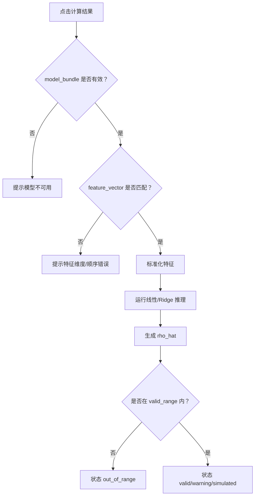

| 运行阶段 | 输入 | 点击交互 | 运行模型 | 输出 |
|---|---|---|---|---|
| 标准化 | `feature_vector`、`scaler_mean/std` | 点击“计算结果” | `x_scaled = (x - mean) / std` | 标准化特征 |
| 线性推理 | 标准化特征、系数 | 自动运行 | `rho_hat = intercept + Σ beta_i*x_i` | 预测值 |
| 范围判定 | `rho_hat`、`valid_range` | 自动运行 | `<0`、`>0.75`、接近上限判定 | `result_status` |
| 置信等级 | 质控、范围、模型指标 | 自动运行 | 规则引擎：质控失败/范围边缘/模拟标记 | `confidence_level` |
| 模拟标记 | `source_mode` | 自动运行 | 若 simulated 则全流程显示模拟徽标 | `source_badge` |

---

## 8. 结果详情决策树

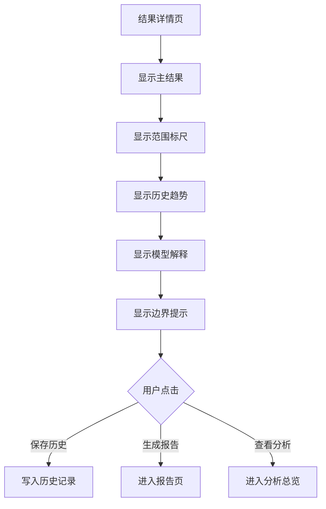

| 结果区块 | 输入 | 点击交互 | 反馈响应 / 运行模型 | 输出 |
|---|---|---|---|---|
| 主结果卡 | `prediction_result` | 无 | 大数字显示 `0.35 mg/cm2`；显示 `NaCl eq.` | 用户可读结果 |
| 范围标尺 | `valid_range`、`rho_hat` | 点击/长按可查看范围解释 | 标出当前位置；接近上限显示 warning | 范围解释 |
| 历史趋势图 | 最近 N 次记录 | 点击点位 | 显示对应样品、时间、模型版本 | 趋势图 |
| 模型解释图 | 特征贡献 | 点击特征条 | 展示白化/纹理/高光/饱和度差贡献 | 模型解释 |
| 边界提示 | 模型边界、source_mode | 无 | 固定显示“仅用于实验筛查和模型验证” | 风险说明 |
| 保存按钮 | 当前结果 | 点击“保存历史” | 写入 repository；模拟结果标记 | 历史记录 |
| 报告按钮 | 当前结果 + 图像 + 特征 | 点击“生成报告” | 生成报告预览 | 报告页 |

---

## 9. 历史与分析决策树

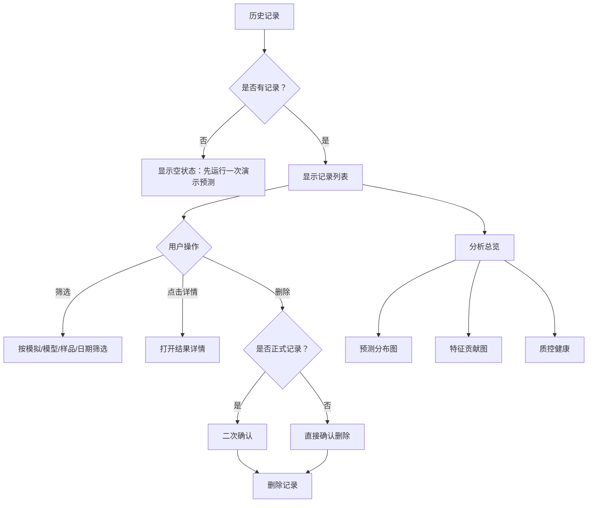

| 模块 | 输入 | 点击交互 | 反馈响应 | 输出 |
|---|---|---|---|---|
| 历史列表 | 本地 records | 点击筛选 chip | 列表刷新；保留模拟徽标 | 过滤结果 |
| 记录卡 | 单条结果 | 点击卡片 | 打开结果详情 | result detail |
| 范围条 | `rho_hat`、valid range | 无 | 直观比较低/中/接近上限 | 范围位置 |
| 删除记录 | record id | 点击删除 | 正式记录二次确认；模拟记录普通确认 | 删除结果 |
| 分析总览 | records + features | 点击“分析” | 生成分布、贡献、质控图 | analysis view |

---

## 10. 报告导出决策树

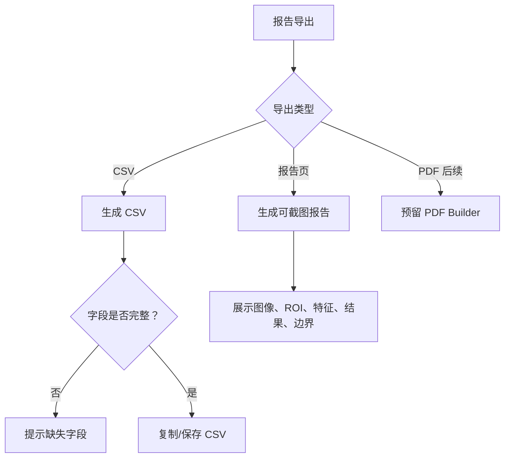

| 导出内容 | 输入 | 点击交互 | 反馈响应 | 输出 |
|---|---|---|---|---|
| CSV | result、sample、model、features | 点击“复制 CSV” | 生成字段；复制成功 toast | CSV 文本 |
| 报告页 | 图像、ROI、模型、结果 | 点击“生成报告” | 打开可截图报告页 | report preview |
| 模型卡 | model_bundle | 点击“查看模型卡” | 显示范围、指标、特征顺序 | model card |
| 风险说明 | 固定模板 | 自动附加 | “不作为食品安全判定” | 报告边界 |

CSV 必须包含：

```text
session_id,sample_id,model_id,source_mode,hardware_profile_id,
baseline_image_path,salted_image_path,roi_area_cm2,
dL,da,db,dS,whiteness_index,specular_ratio,glcm_contrast,glcm_energy,
predicted_mg_cm2,unit,confidence_level,result_status,created_at,notes
```

---

## 11. 点击验证台决策树

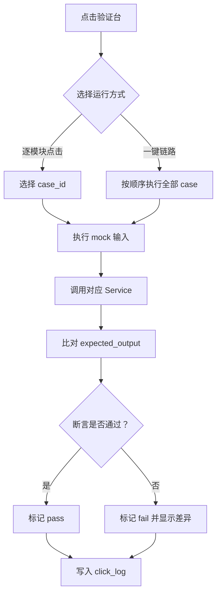

| case_id | 输入 | 点击交互 | 运行模块 | 预期输出 |
|---|---|---|---|---|
| M01_HOME | `source_mode=simulated` | 点击“开始采集预测” | Router | 进入采集页 |
| M02_MODEL | mock model bundle | 点击“启用模型” | ModelBundleService | active model 可用 |
| M03_QC_PASS | mock 图像、灰卡 RSD=1.2% | 点击“开始质控” | QualityControlService | qc passed |
| M04_QC_FAIL | 过曝图像 | 点击“过曝异常” | QualityControlService | 阻断下一步 |
| M05_CAPTURE_I0 | mock baseline | 点击“使用模拟 I0” | CaptureWorkflowService | 保存基线图路径 |
| M06_CAPTURE_I1 | mock salted | 点击“使用模拟 I1” | CaptureWorkflowService | 保存待测图路径 |
| M07_ROI | ROI polygon | 点击“确认 ROI” | RoiService | ROI 面积有效 |
| M08_FEATURE | I0/I1/ROI | 点击“提取特征” | FeatureExtractionService | feature_vector 完整 |
| M09_PREDICT | features + model | 点击“计算结果” | PredictionService | 输出 0.35 mg/cm2 |
| M10_RESULT | prediction_result | 点击“查看结果” | ResultViewModelBuilder | 图表完整 |
| M11_SAVE | result session | 点击“保存历史” | Repository | 历史新增 |
| M12_HISTORY | records | 点击历史记录 | HistoryService | 列表显示模拟徽标 |
| M13_ANALYSIS | records + features | 点击分析总览 | AnalysisService | 图表显示 |
| M14_EXPORT | result | 点击复制 CSV | ExportService | CSV 字段完整 |
| M15_FULL_CHAIN | all mock cases | 点击“一键链路” | ClickValidationService | 汇总 pass/fail |

点击日志字段：

```text
case_id,module,action,mock_input,service_output,expected_output,
assertion,result,duration_ms,error_message,screenshot_path,created_at
```

---

## 12. 异常与阻断决策树

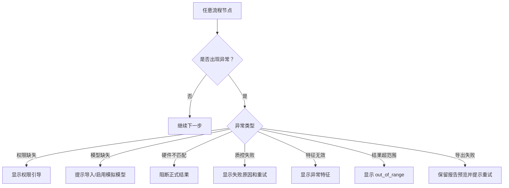

| 异常 | 触发条件 | 用户反馈 | 是否阻断 | 输出状态 |
|---|---|---|---|---|
| 权限缺失 | 相机/文件权限不可用 | “请开启相机权限” | 是 | `permission_missing` |
| 模型缺失 | 无 active model | “请启用模拟模型或导入模型包” | 是 | `model_missing` |
| 硬件不匹配 | hardware_profile 不一致 | “当前配置与模型不匹配” | 正式结果阻断 | `hardware_mismatch` |
| 曝光失败 | 饱和像素超阈值 | 显示过曝比例 | 是 | `qc_exposure_failed` |
| 清晰度失败 | 模糊度低于阈值 | 显示重拍建议 | 是 | `qc_blur_failed` |
| ROI 无效 | 面积为 0/越界 | 提示重新选择 ROI | 是 | `roi_invalid` |
| 特征 NaN | 特征计算异常 | 显示异常字段 | 是 | `feature_invalid` |
| 超出范围 | `rho_hat` 不在 valid range | 显示 out_of_range | 正式结果阻断 | `out_of_range` |
| 模拟未标记 | source_mode 缺失 | 强制标记或阻断保存 | 是 | `simulation_unmarked` |

---

## 13. 第一阶段 MVP 验收决策树

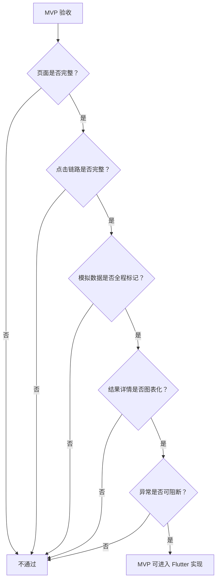

| 验收项 | 标准 |
|---|---|
| 页面完整 | 首页、采集、结果、分析、历史、报告/验证台均有页面 |
| 点击完整 | M01-M15 可逐项点击，也可一键全链路 |
| 模拟标记 | 所有模拟图像、模型、结果、历史、报告均显示模拟 |
| 结果图表 | 结果详情必须有范围标尺、历史趋势、模型解释 |
| 单位完整 | 所有结果显示 `mg/cm2 NaCl eq.` |
| 模型边界 | 显示 valid range；超范围阻断正式结果 |
| 异常阻断 | 权限、模型、硬件、质控、ROI、特征、超范围均可阻断 |
| 禁止误导 | 不出现食品安全合格/不合格、能不能吃、执法检测 |

